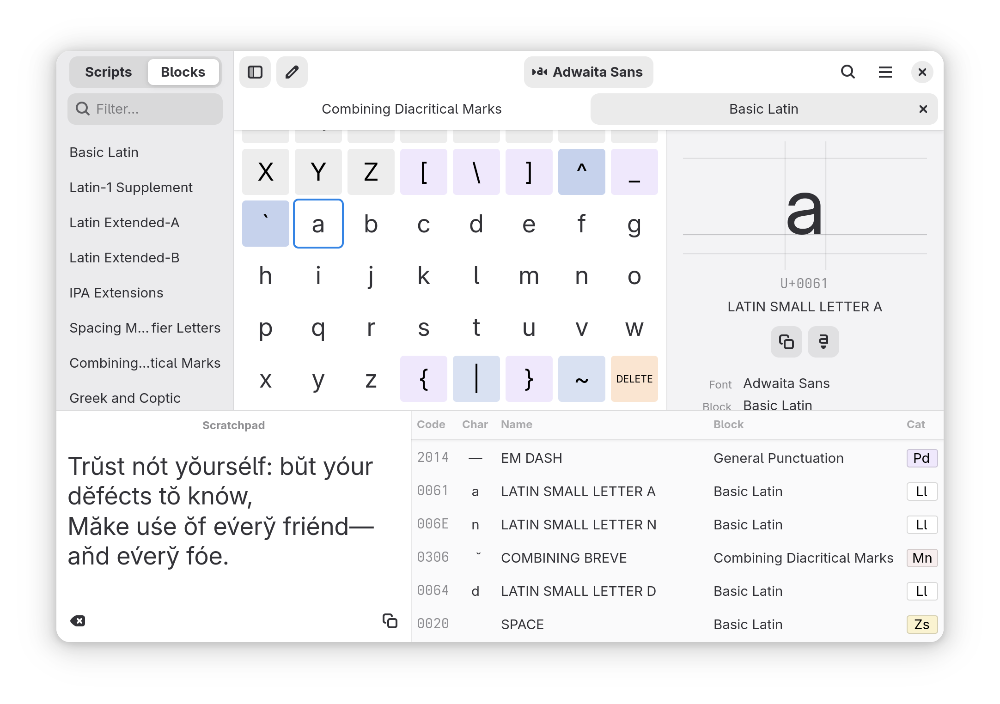

# Runemaster

*Runemaster* is a character viewer app made for GNOME.



## Features

- Browse Unicode characters, by block or script, color coded by general category.
- See details for each character, including cross references, comments, HTML entities, and compose key sequences.
- Compose and edit text in the scratchpad. Apply normalization, change casing, and see the code point breakdown.

## Installation

Dependencies:

- `gjs`
- `gtk4`
- `libadwaita (>= 1.7)`

The following dependencies are required for building:

- `meson (>= 0.59)`
- `pkg-config`
- `gettext`

To install, run the following commands:

```
meson setup build
ninja -C build install
```

To uninstall, run

```
ninja -C build uninstall
```


### Run without installing

It's possible to run directly from the source tree without building or installing by running

```bash
gjs -m runemaster.js
```

This can be useful if you just want to quickly try it out or test a change.
